## Lab 01. IoT接入与消息发送

### 实验概述
本实验描述如何将模拟设备接入AWS IoT. 
AWS IoT使用证书进行双向认证, 模拟设备接入前需要配置证书及私钥，设备通过证书与私钥即可连接至AWS IoT并进行加密传输。
AWS IoT云端可进行策略配置，策略是与证书相绑定，通过策略可以限制IoT设备连接与消息收发的权限。

### 架构图

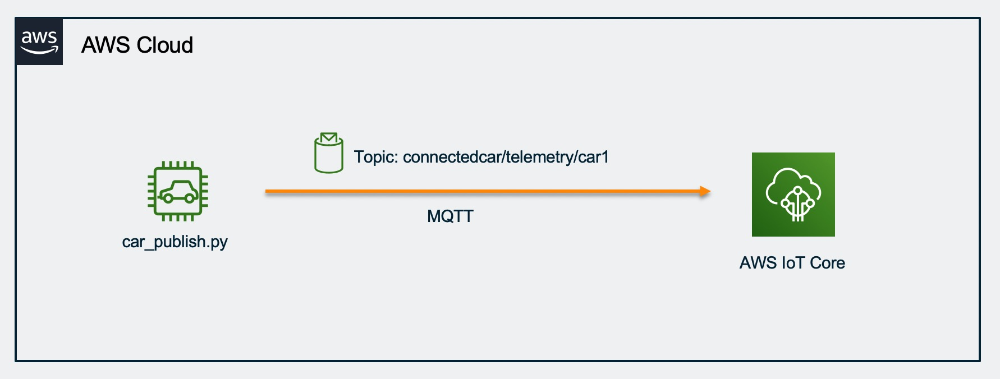

### 1. AWS IoT 创建事物(Thing)并下载证书/私钥

- 登录到 AWS 管理控制台，然后选择服务中的IoT来打开 AWS IoT 控制台。

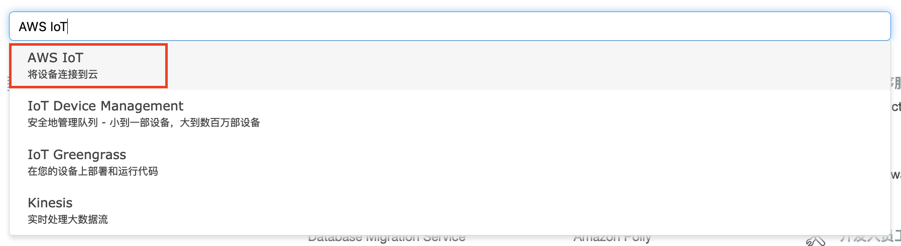

- 请选择主页中的入门培训，点击入门。


- 这段教程将带您注册设备，下载相关文件，请继续点击入门。


- 请在“选择平台“选择“Linux/OSX”， 选择AWS IoT设备开发工具包选择“Python”，点击下一步。


- 在这一步我们将开始注册物品(Thing)，这里可以输入物品名字 “MyIoTDevice"，并点击下一步继续


*注意：Thing Name在每个AWS Account中必须唯一*

- 这里可以看到AWS IoT自动生成的策略、证书以及私有密钥。点击“下载连接工具包”，即 connect_device_package.zip 文件。下载完成后点击下一步继续。


- 点击“完成”结束Thing创建。


- 继续点击“完成”结束该向导。


- 回到IoT控制台页面，在“管理”-“物品”可以看到刚刚注册的Thing。


### 2. AWS IoT 创建策略(Policy)

- AWS IoT的策略可以用来对IoT设备的连接和消息收发进行权限控制，这里为了演示需要，我们创建一个最为宽松的策略

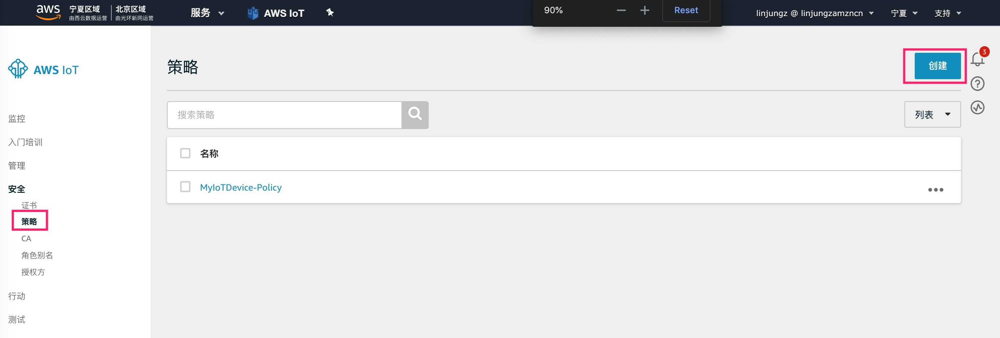


*注意：仅在测试环境使用宽松的策略，生产环境建议要遵循最小权限原则，仅授予设备所必须的最小权限*

- 接下来我们将原来自动创建的策略从证书上分离

点击“安全性”：
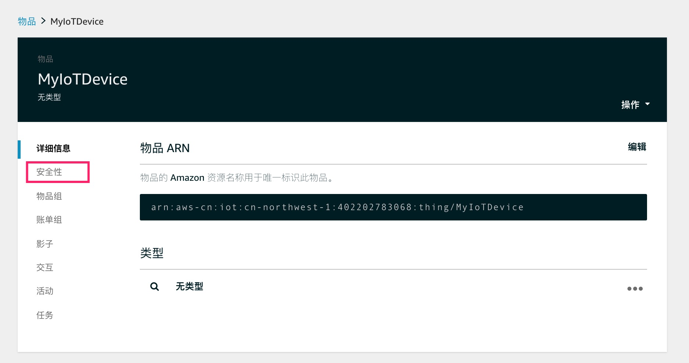

点击证书：
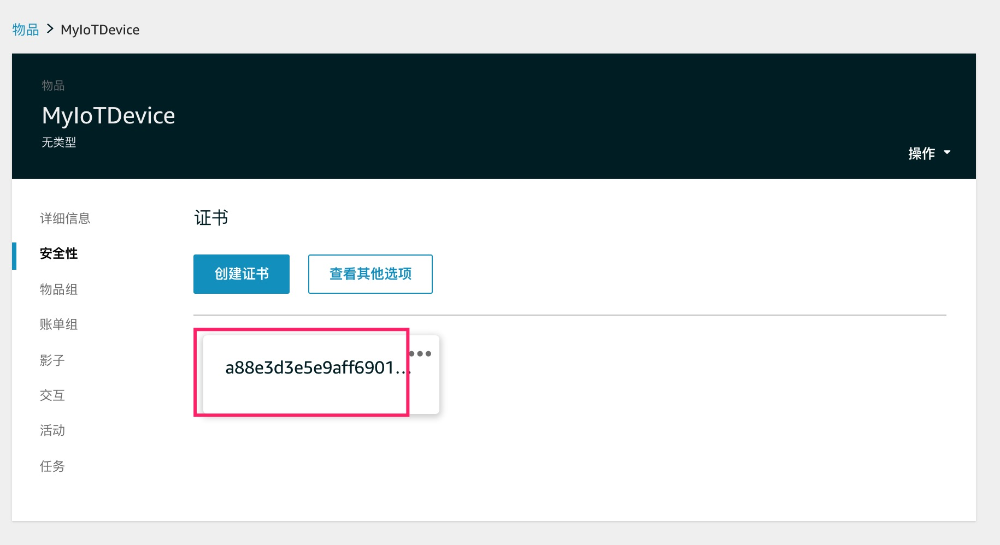

点击”策略“：
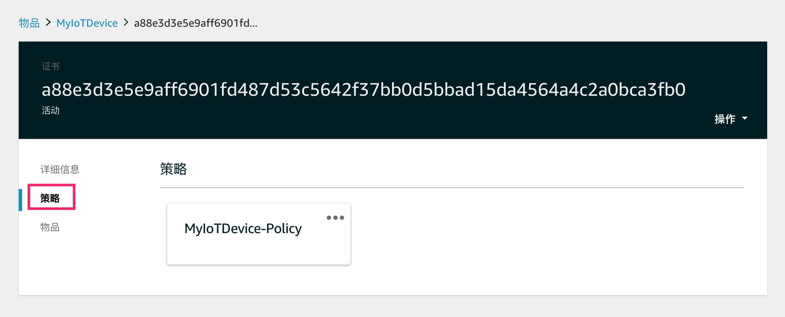

点击”分离”，将原来创建的策略与证书分离：
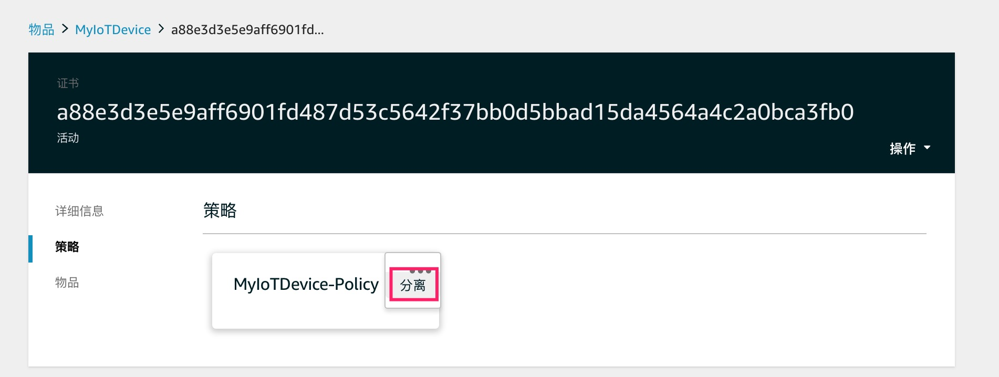

点击”附加策略“，
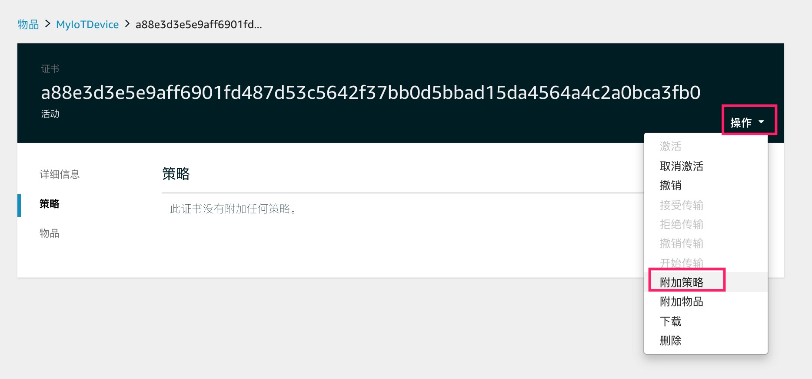

将刚创建的宽松的策略附加到设备证书上：
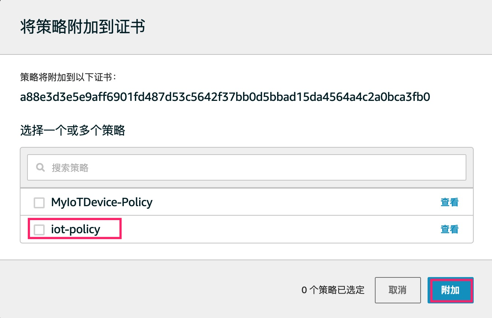

可以看到新的策略已经附加到证书上：
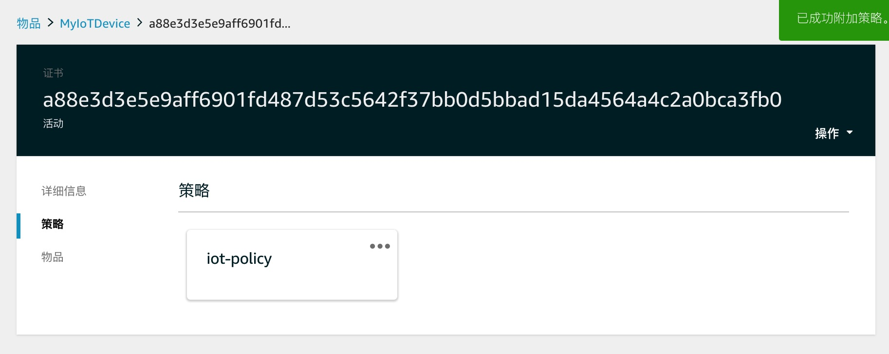

*注：可以对比原有策略与新附加的策略上有什么不同？并尝试修改策略并逐步缩小权限，以了解策略中各个操作所代表的含义*

### 3. 设备连接AWS IoT

- 上传证书/私钥至Cloud9

 解压刚刚下载的”connect_device_package.zip“文件， 可以看到里面有4个文件


上传后缀为cert.pem和private.pem这两个文件，分别是刚才创建的Thing的设备证书和私钥

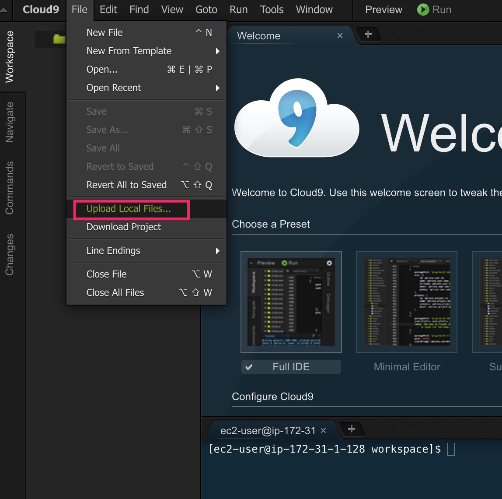

- 下载AWS IoT根证书

在Cloud9终端中输入如下命令：

```sh
curl https://www.amazontrust.com/repository/AmazonRootCA1.pem > root-CA.crt
```

- 下载模拟设备源代码

在终端中输入此命令来下载模拟设备的python源代码(car_publish.py)，该python程序模拟一个IoT设备，连接至AWS IoT并往云端不停发送消息

```sh
wget https://raw.githubusercontent.com/linjungz/iot-cv-demo/master/src/car_publish.py
```

- 修改模拟设备代码以更新IoT连接信息

找到代码中如下部分并进行相应替换

```python
#Setup MQTT client and security certificates
mqttc = AWSIoTMQTTClient("MyIoTDevice")   #请将Clientid设置为ThingName，在每个AWS Account中需要唯一
mqttc.configureEndpoint("ChangeToYouEnd.iot.cn-north-1.amazonaws.com.cn",8883) #更改为对应的Endpoint地址

mqttc.configureCredentials(
  './root-CA.crt',                # 参考Cloud9中的文件名进行更改
  './MyIoTDevice.private.key',    # 参考Cloud9中的文件名进行更改
  './MyIoTDevice.cert.pem'        # 参考Cloud9中的文件名进行更改
)
```

如下是确定IoT Endpoint的方法：
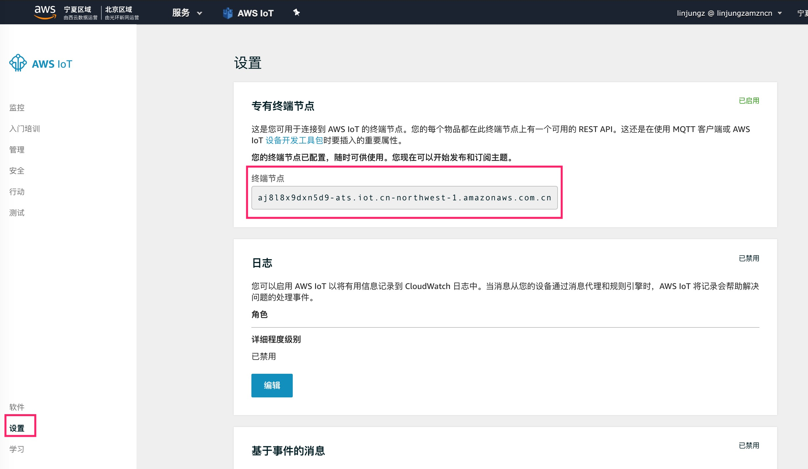


- 运行模拟设备程序，并在云端检查是否收到消息

在Cloud9上运行模拟设备程序,并检查程序输出
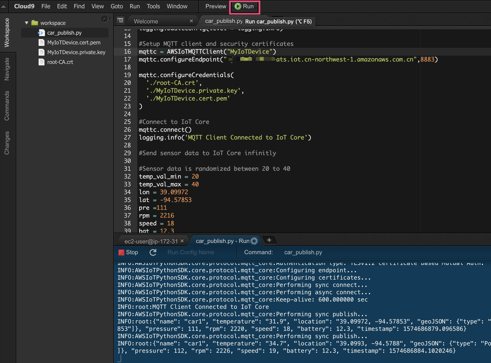

在AWS IoT控制台上查看消息是否已经发送上来：

在IoT控制台提供的MQTT客户端上，可以对MQTT主题进行订阅，从而收到相应主题下的MQTT消息。这里订阅主题输入”#"，即订阅所有主题下的消息：
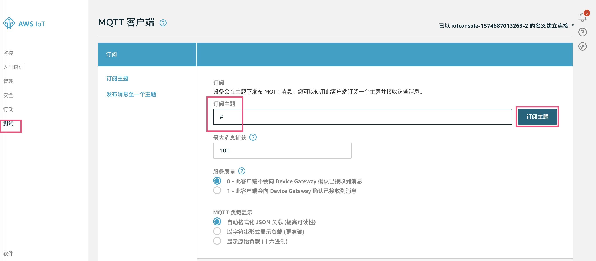

可以看到设备端的消息不断的打到云端上来，从MQTT客户端上可以看到消息的主题和具体的Payload
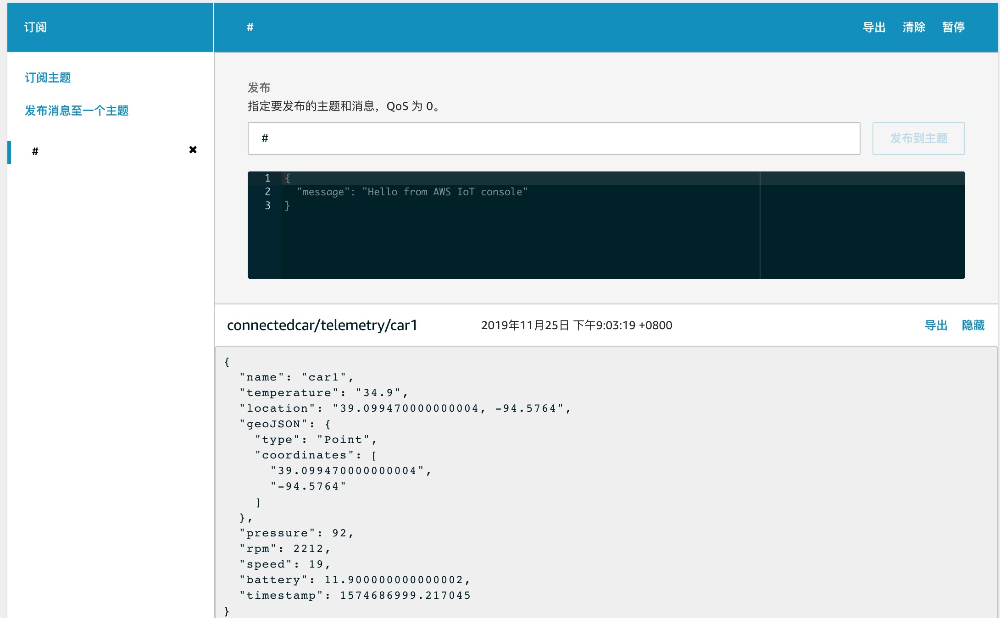