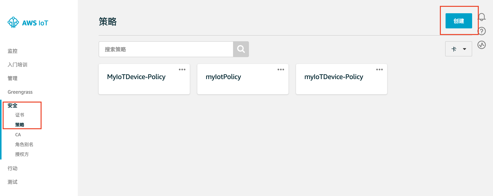
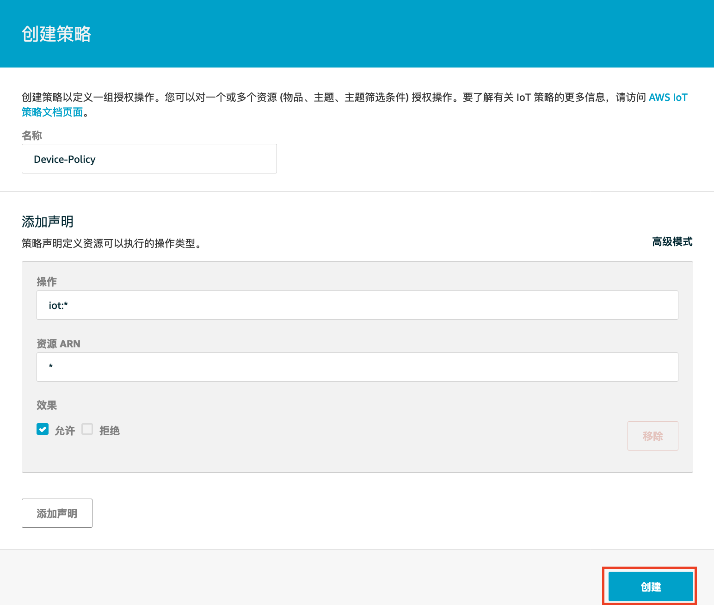
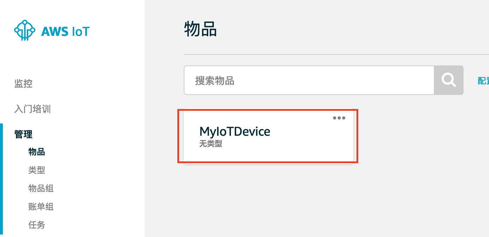
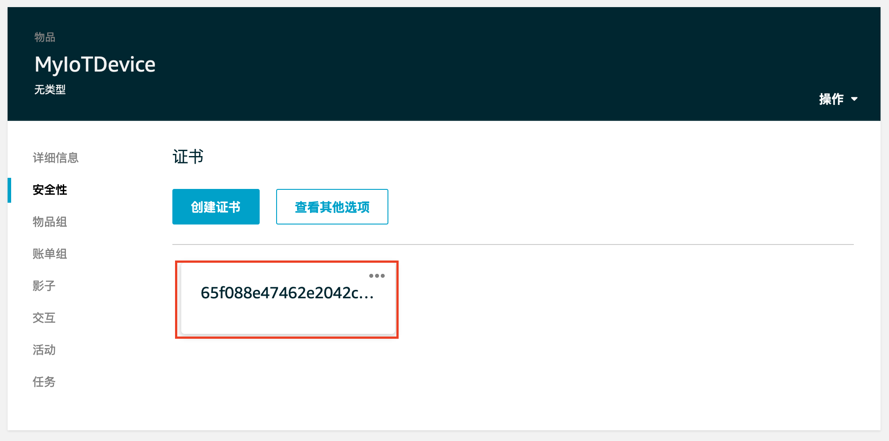
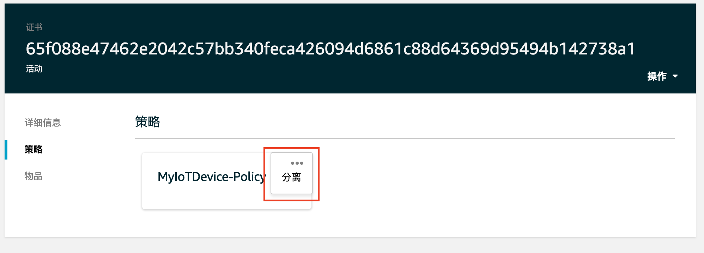
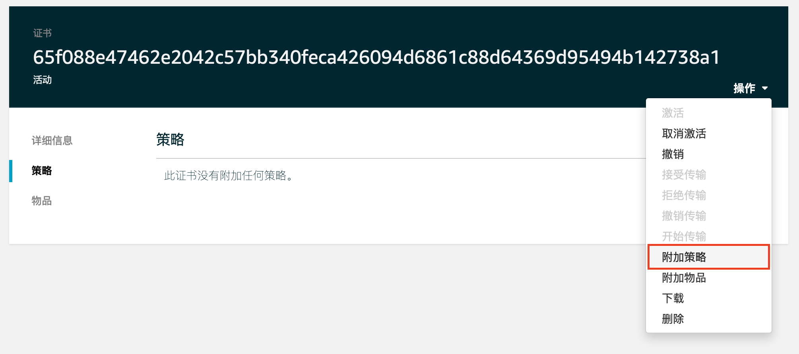
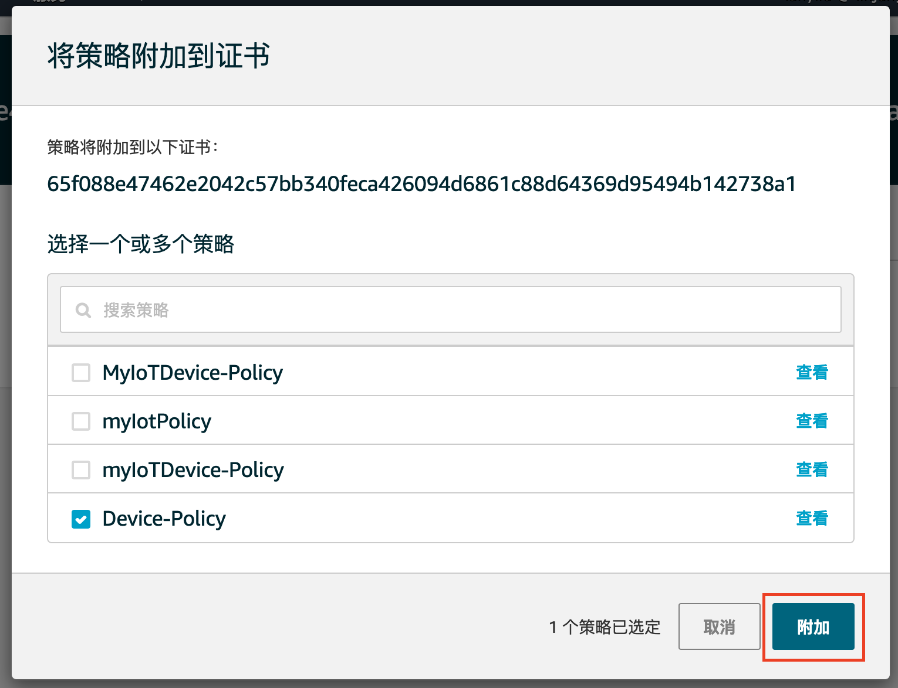
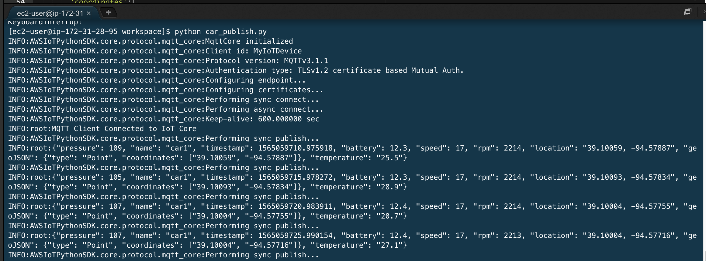
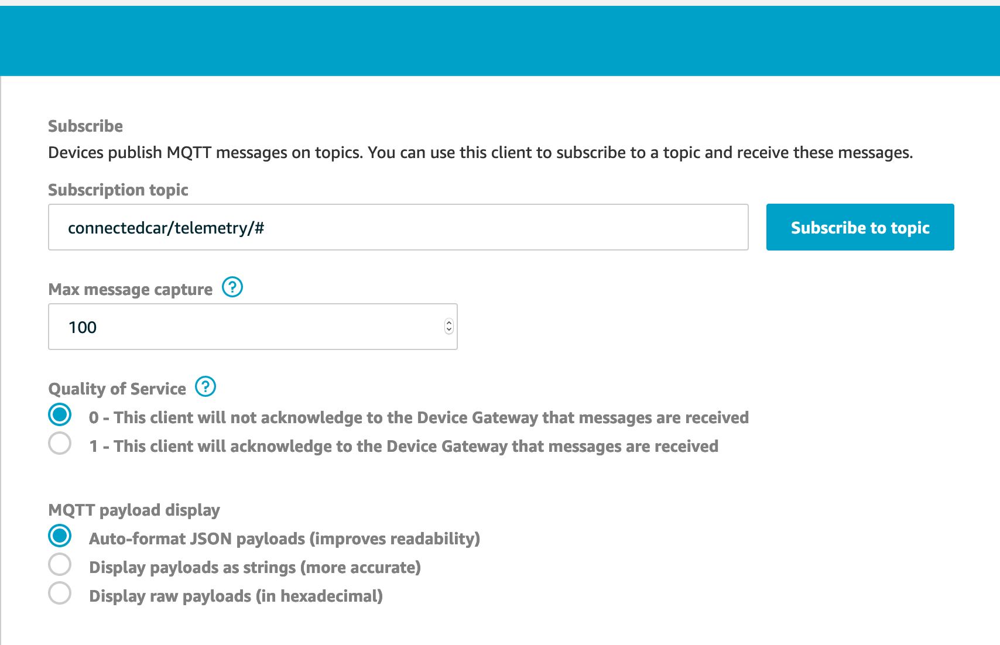
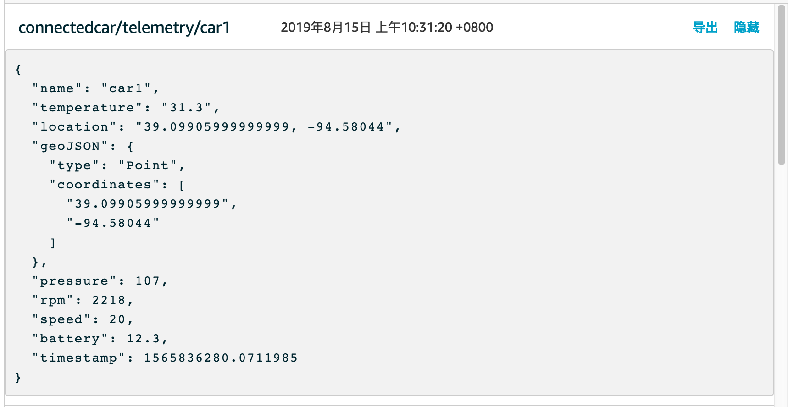

本实验描述如何将车辆接入车联网后台. AWS IoT使用证书进行双向认证, 车辆接入前需要配置证书和策略,并将证书下载至车端.

## 1. 创建事物, 证书和策略

iot core上生成证书, 策略

### 1.1 登录 AWS IoT 控制台

- 登录到 AWS 管理控制台，然后选择服务中的IoT来打开 AWS IoT 控制台。

<a data-fancybox="gallery" href="https://iot-demo-resource.s3-ap-southeast-1.amazonaws.com/page1/1.png">
</a>


- 请选择主页中的入门培训，点击入门。
<a data-fancybox="gallery" href="https://iot-demo-resource.s3-ap-southeast-1.amazonaws.com/page1/2.png">
</a>


- 这段教程将带您注册设备，下载相关文件，请继续点击入门。
<a data-fancybox="gallery" href="https://iot-demo-resource.s3-ap-southeast-1.amazonaws.com/page1/3.png">
</a>


- 请在“选择平台“选择“Linux/OSX”， 选择AWS IoT设备开发工具包选择“Python”，点击下一步。
<a data-fancybox="gallery" href="https://iot-demo-resource.s3-ap-southeast-1.amazonaws.com/page1/4.png">
</a>


### 1.2 注册物品并下载证书

- 在这一步我们将开始注册物品，请为物品输入您喜欢的名称。这里为物品命名为“MyIoTDevice",请勿输入中文。点击下一步。
<a data-fancybox="gallery" href="https://iot-demo-resource.s3-ap-southeast-1.amazonaws.com/page1/5.png">
</a>


- 这里为您刚刚注册的设备生成了一个策略、证书以及私有密钥。策略可以稍后查看，请点击“下载连接工具包”。工具包下载完毕后您会获得一个叫”connect_device_package.zip“的文件，请点击下一步。
<a data-fancybox="gallery" href="https://iot-demo-resource.s3-ap-southeast-1.amazonaws.com/page1/6.png">
</a>


- 这一步告诉您如何配置和测试设备，我们将在启动EC2虚拟机后用到，点击“完成”。
<a data-fancybox="gallery" href="https://iot-demo-resource.s3-ap-southeast-1.amazonaws.com/page1/7.png">
</a>


- 继续点击“完成”以完成IoT入门。
<a data-fancybox="gallery" href="https://iot-demo-resource.s3-ap-southeast-1.amazonaws.com/page1/8.png">
</a>


- 回到IoT主页，此时在管理-物品将能看的您刚刚注册的物品。
<a data-fancybox="gallery" href="https://iot-demo-resource.s3-ap-southeast-1.amazonaws.com/page1/9.png">
</a>


- 解压刚刚的”connect_device_package.zip“文件， 您会获得4个文件
<a data-fancybox="gallery" href="https://iot-demo-resource.s3-ap-southeast-1.amazonaws.com/page1/10.png">
</a>


### 1.3 创建新的策略

- 下面我们将创建自己的证书来代替刚刚自动生成的证书。首先，在主控制台的“安全”->“策略”中点击“创建证书”
<a data-fancybox="gallery" href="https://iot-demo-resource.s3-ap-southeast-1.amazonaws.com/page1/11.png">
</a>



- 对于策略设定一个您喜欢的名字，在操作中输入“iot:*”，在资源ARN中输入“\*”，对于效果选择“允许”，点击创建。
<a data-fancybox="gallery" href="https://iot-demo-resource.s3-ap-southeast-1.amazonaws.com/page1/12.png">
</a>



- 在主控制台的“管理”->“物品”中单击您刚刚创建的物品，进入详情页面。
<a data-fancybox="gallery" href="https://iot-demo-resource.s3-ap-southeast-1.amazonaws.com/page1/13.png">
</a>



- 选择“安全性”，在此处可以看见物品的证书，点击证书。
<a data-fancybox="gallery" href="https://iot-demo-resource.s3-ap-southeast-1.amazonaws.com/page1/14.png">
</a>



- 在“策略”中找到您刚刚自动生成的策略，点击右上角将其分离。
<a data-fancybox="gallery" href="https://iot-demo-resource.s3-ap-southeast-1.amazonaws.com/page1/15.png">
</a>



- 选择“操作”->“附加策略”
<a data-fancybox="gallery" href="https://iot-demo-resource.s3-ap-southeast-1.amazonaws.com/page1/16.png">
</a>



- 请将刚刚创建的策略附加到证书。
<a data-fancybox="gallery" href="https://iot-demo-resource.s3-ap-southeast-1.amazonaws.com/page1/17.png">
</a>



## 2. 将设备连接

- 在Cloud9的终端中输入此命令来下载根证书

```sh
  curl https://www.amazontrust.com/repository/AmazonRootCA1.pem > root-CA.crt
```

- 上传您的xxx.cert.pem以及xxx.private.pem，此文件位于您刚刚解压的connect_device_package压缩包中。
<a data-fancybox="gallery" href="https://iot-demo-resource.s3-ap-southeast-1.amazonaws.com/code/3.png">
</a>


- 在终端中输入此命令来下载car_publish.py文件，点击打开

```sh
wget https://raw.githubusercontent.com/lanskyfan/iot-cv-demo/master/src/car_publish.py
```

- 此时您的所有文件将包括以下这些
<a data-fancybox="gallery" href="https://iot-demo-resource.s3-ap-southeast-1.amazonaws.com/code/4.png">
</a>


- 将car_publish.py中的IoT终端节点、证书、私钥文件名替换为您的节点以及文件名：

```python
#Setup MQTT client and security certificates
mqttc = AWSIoTMQTTClient("MyIoTDevice") 
mqttc.configureEndpoint("ChangeToYouEnd.iot.cn-north-1.amazonaws.com.cn",8883) # 需要更改（方法见下文）

mqttc.configureCredentials(
  './root-CA.crt',                # 参考Cloud9中的文件名更改
  './MyIoTDevice.private.key',    # 参考Cloud9中的文件名更改
  './MyIoTDevice.cert.pem'        # 参考Cloud9中的文件名更改
)
```

- 如需寻找您的终端节点，请打开IoT服务，进入您的物品，并进入交互部分，请将终端节点记住。
<a data-fancybox="gallery" href="https://iot-demo-resource.s3-ap-southeast-1.amazonaws.com/code/5.png">
</a>


- 在终端使用python3运行您的car_publish.py文件,传递的数据将会显示在您的终端上

```sh
python3 car_publish.py
```

<a data-fancybox="gallery" href="https://iot-demo-resource.s3-ap-southeast-1.amazonaws.com/code/6.png">
</a>



- 回到IoT主页中，进入测试并点击订阅
<a data-fancybox="gallery" href="https://iot-demo-resource.s3-ap-southeast-1.amazonaws.com/page2/1.png">
</a>


- 在订阅主题栏中输入“connectedcar/telemetry/#”并点击订阅主题，您将看到从您的EC2发送的消息。
<a data-fancybox="gallery" href="https://iot-demo-resource.s3-ap-southeast-1.amazonaws.com/page2/2.png">
</a>



- 消息类似下图
<a data-fancybox="gallery" href="https://iot-demo-resource.s3-ap-southeast-1.amazonaws.com/page2/3.png">
</a>



