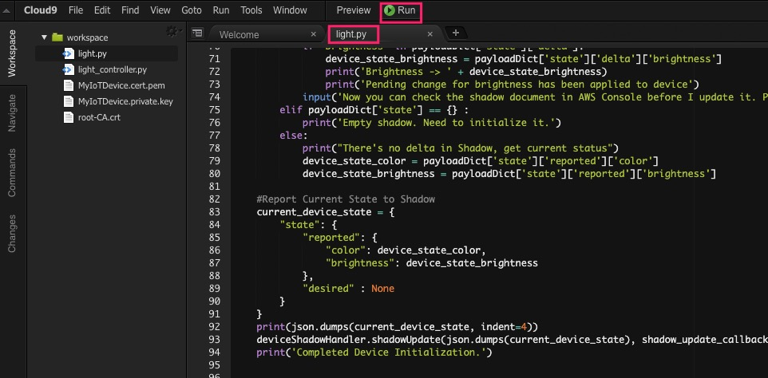
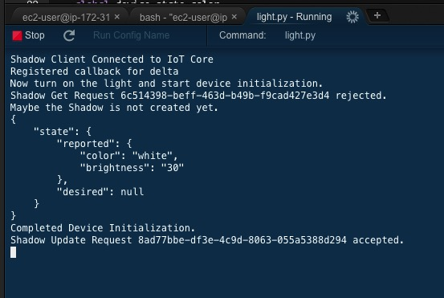
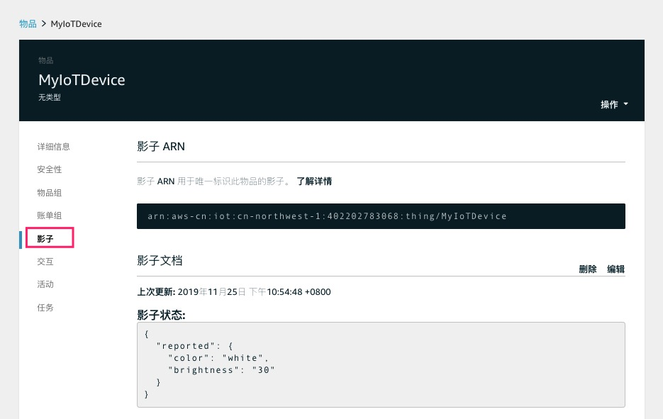
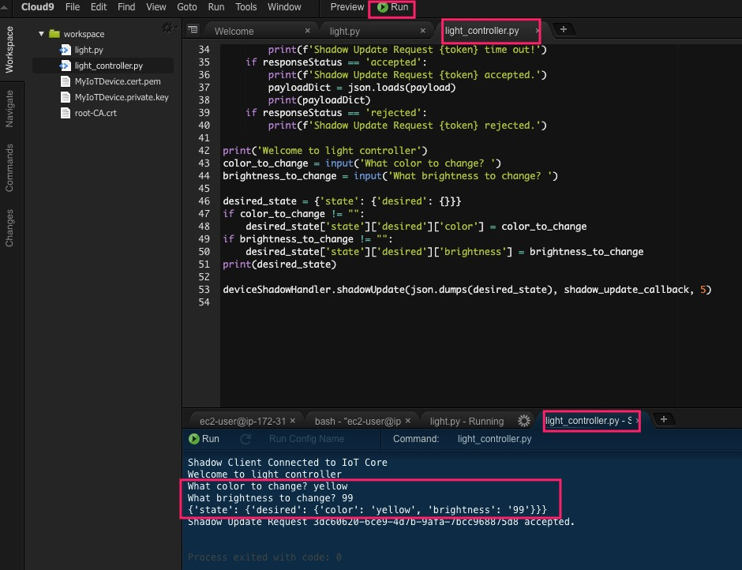
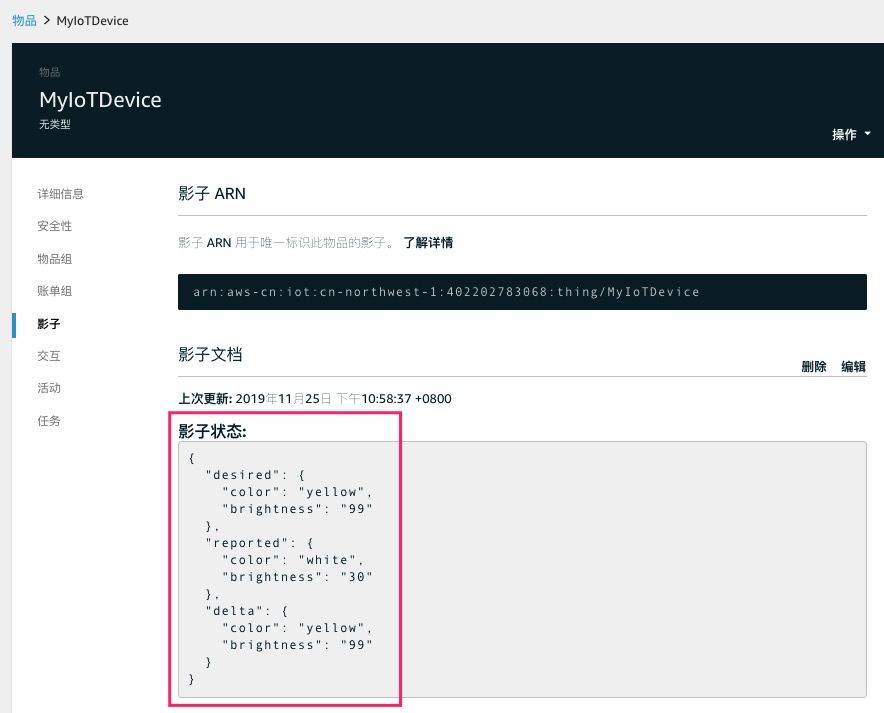
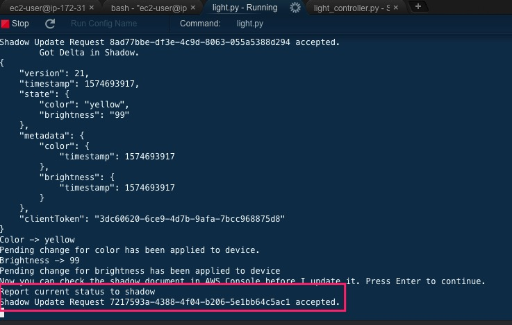
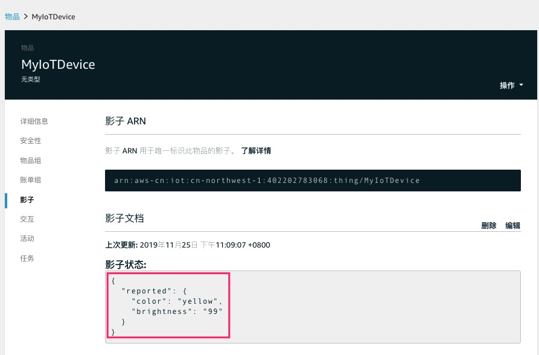

## Lab 02. 设备状态控制

本实验将演示如何通过AWS IoT Shadow对设备进行控制。
通过两个python程序，本实验将演示一个控制器如何通过AWS IoT将指令发送到设备端。
模拟设备是一个灯，可以有亮度和颜色两种状态。

### 演示代码

- light.py  模拟设备（灯）
- light_controller.py 模拟设备控制器

### 1. 实验前检查

在开始本实验之前，需要先完成上一个实验：Lab 01. 接入IoT并上传数据

### 2. 下载演示代码

- 在Cloud9终端中输入命令来下载light.py和light_controller.py两个演示代码

```sh
wget https://raw.githubusercontent.com/linjungz/iot-cv-demo/master/src/light.py
```

```sh
wget https://raw.githubusercontent.com/linjungz/iot-cv-demo/master/src/light_controller.py
```

- 更新light.py和light_controller.py文件中的连接信息

利用上一个实验创建的Thing和证书，这个实验的两个模拟设备可以利用同一个证书，设置不同的ClientID即可。

如下是light.py的更新建议：

```python
#Setup MQTT client and security certificates
shadowc = AWSIoTMQTTShadowClient('MyIoTDevice-Light')  # 更改为ThingName-Light，在每个AWS Account中需要唯一
mqttc.configureEndpoint("ChangeToYouEnd.iot.cn-north-1.amazonaws.com.cn",8883) # #更改为对应的Endpoint地址

mqttc.configureCredentials(
  './root-CA.crt',                # 参考Cloud9中的文件名更改
  './MyIoTDevice.private.key',    # 参考Cloud9中的文件名更改
  './MyIoTDevice.cert.pem'        # 参考Cloud9中的文件名更改
)
```

```python
#Create Device Shadow Handler with persistent subscription
deviceShadowHandler = shadowc.createShadowHandlerWithName('MyIoTDevice', True) # 更改为ThingName, 在每个AWS Account中需要唯一
```

-如下是light_controller.py的更新建议：

```python
#Setup MQTT client and security certificates
shadowc = AWSIoTMQTTShadowClient('MyIoTDevice-Light-Controller') # 更改为ThingName-Light-Controller，在每个AWS Account中需要唯一
mqttc.configureEndpoint("ChangeToYouEnd.iot.cn-north-1.amazonaws.com.cn",8883) # 需要更改（方法见下文）

mqttc.configureCredentials(
  './root-CA.crt',                # 参考Cloud9中的文件名更改
  './MyIoTDevice.private.key',    # 参考Cloud9中的文件名更改
  './MyIoTDevice.cert.pem'        # 参考Cloud9中的文件名更改
)
```

```python
#Create Device Shadow Handler with persistent subscription
deviceShadowHandler = shadowc.createShadowHandlerWithName('MyIoTDevice', True) # 更改为ThingName, 在每个AWS Account中需要唯一
```


- 模拟设备开机

在Cloud9运行light.py文件:



看到如下输出，表示您已经成功初始化了设备。



该程序启动后会检查是否有Shadow，如果没有则会创建一个，并将初始化信息上报到Shadow中（颜色：白色，亮度：30）

在AWS IoT中检查Shadow文档信息：



这个程序会一直运行并监控Shadow的状态，如果发生变化时则会进行相应的处理。
接下来我们尝试通过Shadow来改变这个灯的状态

- 模拟发送指令进行状态变更

接下来我们运行light_controller.py，通过这个模拟的设备控制器，来发送控制指令。



按照提示输入希望更改的灯的颜色以及亮度，这里期望更改为的状态是： 颜色=黄色，亮度=99
程序会构造一个json，并将其发送到Shadow中，然后程序就会结束
此时控制指令已经发送到云端并被记录下来，如果这时候设备在线的话，设备会接收到Shadow的变更通知，进而触发相应的动作

- 检查设备端如何进行Shadow的处理

由于刚才一直保持light.py程序运行，相当于设备在线，这时候我们可以查看设备端的输出：


此时模拟设备已经接受到指令，如果在真实的物理设备上，这时候可以执行相应的代码，对设备进行状态变更
在设备状态变更成功后，设备端应该重新上报状态，但为了演示需要，这里我们先暂停下来，以便我们可以有时间检查一下云端的Shadow是如何的

- 检查云端Shadow信息

这时候我们会看到，在控制指令发送到云端后，Shadow中有三段信息：
* Desired: 即期望变更的状态
* Reported: 即变更前的状态
* Delta: 即Reported与Desired之间的差异量，设备可以根据这个Delta信息来进行状态调整



- 设备重新上报状态，并再次检查云端Shadow信息

回到 light.py，我们按下回车，让设备将更新后的状态重新上报：



接着我们在云端检查一下Shadow信息：



这时候设备状态重新上报，Shadow中只保留Reported状态了。


